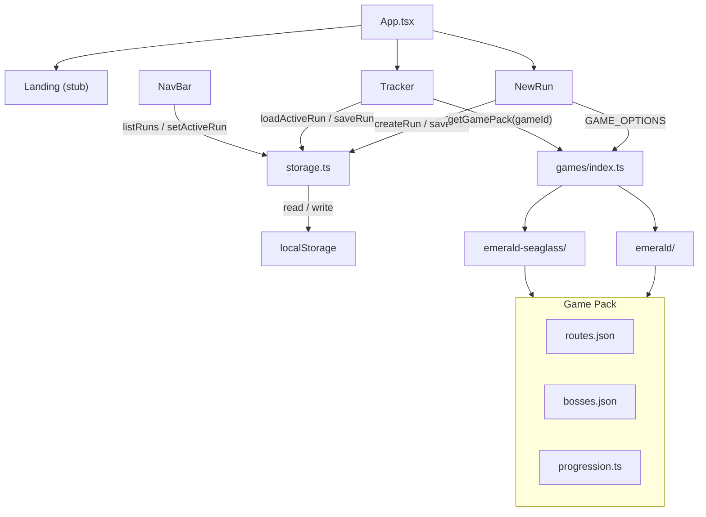

# Nuzzy — Architecture & Roadmap

Internal reference for contributors and future-you. Covers the current codebase layout, data model, persistence contract, how to add game packs, and the Phase 2 backlog.

For the public-facing overview, see [README.md](README.md).

---

## Current State

### Stack

| Dependency | Version |
|---|---|
| React | 19 |
| Vite | 8 |
| React Router | 7 |
| Tailwind CSS | 4 (via `@tailwindcss/vite`, no PostCSS / config file) |
| TypeScript | ~5.9 |
| ESLint | 9 |

### What works today

- **Run management** — Create and persist multiple runs in a versioned localStorage library. Switch between runs via the navbar dropdown.
- **Game picker** — `NewRun` offers a game selector backed by `GAME_OPTIONS`. Pokémon Emerald is live; Emerald Seaglass is registered but gated (`disabled: true`).
- **Progression tracker** — Routes and boss fights render in game order via per-game `progression` arrays. Each route section shows a species selector drawn from the route's `catchPool`.
- **Encounter logging** — Log a catch per route, assign a nickname, track status (`Alive` / `Dead` / `Boxed`). Status is editable inline.
- **Boss reference** — Boss sections display team tables (species, types, moves, held items).
- **Persistence** — Runs are stored under `nuzzy_run_library` with schema migration from the legacy single-run `nuzzy_run` key.
- **Landing page** — Stub (`return null`); first priority for Phase 2.

---

## Architecture



---

## Folder Layout

```
src/
├── components/
│   └── NavBar.tsx            # Top nav with run-switcher dropdown
├── pages/
│   ├── Landing.tsx           # Stub — returns null
│   ├── NewRun.tsx            # Run name + game selector → createRun
│   └── Tracker.tsx           # Progression-ordered route/boss sections
├── run/
│   └── storage.ts            # localStorage CRUD, migration, library wrapper
├── data/
│   ├── routes.ts             # DEPRECATED — thin re-export of Seaglass route names
│   └── games/
│       ├── index.ts          # GAME_REGISTRY, getGamePack(), GAME_OPTIONS
│       ├── emerald/
│       │   ├── routes.json
│       │   ├── bosses.json
│       │   ├── progression.ts
│       │   ├── emeraldEncounters.txt   # source material
│       │   └── emeraldBosses.txt       # source material
│       └── emerald-seaglass/
│           ├── routes.json
│           ├── bosses.json
│           └── progression.ts
├── types/
│   ├── index.ts              # Run, Encounter, Status (re-exports game.ts)
│   └── game.ts               # GamePack, RouteDef, BossDef, ProgressionSegment
├── App.tsx                   # BrowserRouter, layout shell, route definitions
└── main.tsx                  # React root render
```

> `src/data/routes.ts` is a **deprecated** shim that maps Seaglass `routes.json` names to a flat `string[]`. All new code should use `getGamePack()`.

---

## Data Model

### Game pack types (`src/types/game.ts`)

```ts
interface RouteDef {
  id: string
  name: string
  catchPool?: string[]
  notes?: string
  subsection?: string
}

interface BossPokemon {
  species: string
  types: string[]
  moves: string[]
  item: string | null
}

interface BossDef {
  id: string
  name: string
  location?: string
  rematch?: boolean
  team: BossPokemon[]
}

type ProgressionSegment =
  | { kind: "route"; routeId: string }
  | { kind: "boss"; bossId: string }

interface GamePack {
  routes: RouteDef[]
  bosses: BossDef[]
  progression: ProgressionSegment[]
}
```

### Persisted run types (`src/types/index.ts`)

```ts
type Status = "Alive" | "Dead" | "Boxed"

interface Encounter {
  id: string
  routeId: string       // stable id from RouteDef, NOT display name
  pokemon: string
  nickname: string
  status: Status
}

interface Run {
  id: string
  name: string
  gameId: string        // lookup key into GAME_REGISTRY
  gameTitle?: string    // display-only override
  createdAt: string
  encounters: Encounter[]
  schemaVersion: number // currently 1
}
```

Key design choice: encounters reference routes by **stable `routeId`** (e.g. `"route-101"`), not display name. This decouples the data from UI labels and makes migration safer.

---

## Persistence Contract

All run data lives in `localStorage` under two keys, managed by `src/run/storage.ts`.

### Keys

| Key | Shape | Purpose |
|---|---|---|
| `nuzzy_run_library` | `RunLibrary` (schema v2) | Primary store. Array of `Run` objects + `activeRunId`. |
| `nuzzy_run` | Single `Run` object (legacy) | V0 prototype key. Migrated into the library on first load, then deleted. |

### RunLibrary shape

```ts
interface RunLibrary {
  schemaVersion: 2
  runs: Run[]
  activeRunId: string | null
}
```

### Migration behavior

On load, `getLibrary()` tries in order:

1. Parse `nuzzy_run_library` — if valid v2, use it.
2. Parse legacy `nuzzy_run` — wrap in a library, persist as v2, delete the legacy key.
3. Return an empty library.

Within each run, `parseRunRecord` normalizes older shapes:
- Missing `gameId` defaults to `"emerald"`.
- `game` (string) is copied to `gameTitle` if `gameTitle` is absent.
- Encounters with `route` or `location` (display name strings) are mapped to `routeId` via the game pack's route list. Encounters that can't be mapped are dropped.

### Public API (`storage.ts` exports)

| Function | Purpose |
|---|---|
| `listRuns()` | Return all runs in the library. |
| `loadActiveRun()` | Return the active run, or `null`. |
| `setActiveRun(id)` | Mark a run as active. |
| `saveRun(run)` | Upsert a run and set it active. |
| `deleteRun(id)` | Remove a run; rotate active to first remaining. |
| `createRun({ name, gameId, gameTitle? })` | Build a new `Run` object (does **not** persist — call `saveRun` after). |

---

## How to Add or Enable a Game Pack

1. **Create the data directory** — `src/data/games/<game-id>/` with three files:
   - `routes.json` — array of `RouteDef` objects. Every route needs a unique, stable `id` (kebab-case slug) and a human-readable `name`. Include `catchPool` arrays for encounter logging.
   - `bosses.json` — array of `BossDef` objects. Each boss needs a unique `id`, `name`, optional `location`, and a `team` array.
   - `progression.ts` — ordered array of `ProgressionSegment` entries. Every `routeId` and `bossId` must match an `id` in the corresponding JSON file.

2. **Register the pack** in `src/data/games/index.ts`:
   ```ts
   import newBosses from "./<game-id>/bosses.json";
   import { progression as newProgression } from "./<game-id>/progression";
   import newRoutes from "./<game-id>/routes.json";

   export const NEW_GAME_ID = "<game-id>" as const;

   const newPack = {
     routes: newRoutes,
     bosses: newBosses,
     progression: newProgression,
   } satisfies GamePack;

   // Add to the registry map:
   export const GAME_REGISTRY: Record<string, GamePack> = {
     // ...existing entries
     [NEW_GAME_ID]: newPack,
   };
   ```

3. **Add a `GAME_OPTIONS` entry** (same file):
   ```ts
   export const GAME_OPTIONS: readonly GameOption[] = [
     // ...existing
     { id: NEW_GAME_ID, title: "Pokémon New Game" },
     // Set disabled: true to gate it until QA is complete
   ] as const;
   ```

4. **Verify** — Start a new run with the pack. Walk the progression and confirm every route section renders a species selector and every boss section renders a team table. Look for "Unknown game pack" or missing catch-pool warnings in the UI.

### Enabling Emerald Seaglass

The Seaglass pack already exists in `GAME_REGISTRY`. To enable it, change its `GAME_OPTIONS` entry in `src/data/games/index.ts`:

```ts
{ id: EMERALD_SEAGLASS_GAME_ID, title: "Pokémon Emerald Seaglass" },
// remove disabled: true
```

QA the route/boss data before flipping.

---

## Phase 2 — Priorities

### Improve current functionality

**Landing page** — Replace the stub in `src/pages/Landing.tsx` with a real page: hero section, Nuzlocke rules summary, call-to-action linking to `/new-run`, and (if runs exist) a quick-resume link to `/tracker`.

**Enable Emerald Seaglass** — The pack data is authored and registered. Complete a QA pass on routes, catch pools, boss teams, and progression order, then flip `disabled` to enable selection in `NewRun`.

**Tracker UX**
- Edit and delete encounters (currently encounters can only be added and have status changed).
- Duplicate-route guard — warn or prevent logging a second encounter on the same route.
- Summary strip at the top of the tracker: alive / dead / boxed counts at a glance.
- Collapse/expand route sections to reduce scroll on long runs.
- Keyboard and accessibility pass — focus management, heading hierarchy, screen reader labels.

**Run management**
- Show the active run's name in the navbar (not just a "Load Run" button).
- Delete or rename a run from the UI (the `deleteRun` API already exists but has no UI).
- Better empty state when the library has runs but none is active.

**Sprites** — Fetch sprites from PokéAPI (`https://pokeapi.co/api/v2/pokemon/{name}`) to display alongside encounter and boss entries. Cache aggressively since the API data is static.

**Data quality** — Add a dev-time or CI script that validates every `routeId`/`bossId` in a progression array references an actual entry in the corresponding JSON, catching broken references before they reach the UI.

### New features

**Graveyard / death log** — A dedicated view listing all fallen Pokémon across the run, with cause-of-death notes (requires adding an optional `deathNote` field to `Encounter`).

**Type coverage analysis** — Given the current alive team, show defensive and offensive type coverage gaps. Useful for planning boss fights.

**Export / import** — JSON download and upload so runs can be backed up, shared, or transferred between browsers.

**Run analytics** — Post-run summary: total encounters, death rate, longest streak, most common catch, etc.

**Additional game packs** — Radical Red (route data + boss AI documentation), then mainline titles (FireRed/LeafGreen, Platinum, HeartGold/SoulSilver).

**Cloud sync (long horizon)** — Backend with user auth and persistent storage. Depends on the project outgrowing localStorage.

---

## Development

```bash
# Install dependencies
npm install

# Start dev server
npm run dev

# Type-check without emitting
npx tsc --noEmit

# Lint
npm run lint

# Production build
npm run build
```

> The original step-by-step prototype tutorial that bootstrapped the project is preserved in git history if needed.
