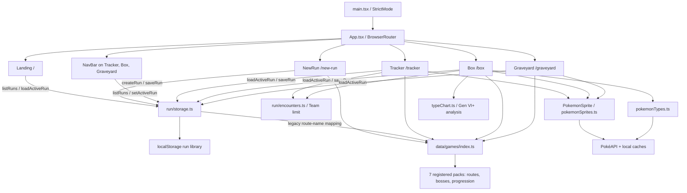

# Nuzzy — Architecture & Roadmap

Contributor reference for the implementation on `main`: layout, data model, persistence, game-pack integration, and longer-term direction. See [README.md](README.md) for the public overview.

[GitHub Issues](https://github.com/RileighLuvsCatz/Nuzzy/issues) is the active state tracker and source of acceptance criteria. The backlog links below are navigation, not a duplicate set of checkboxes. UI exploration on `codex/ui-overhaul` proceeds alongside issue-scoped fixes; only merged changes belong in the implemented-feature inventory.

## Current State

React 19, Vite 8, React Router 7, Tailwind CSS 4 through `@tailwindcss/vite`, TypeScript 5.9, and ESLint 9. See `package.json` for dependency ranges and scripts.

### Implemented behavior

- Landing page with project overview, rules, new-run action, and active-run continuation.
- Multiple named local runs, navbar switching, and legacy-save migration.
- Progression-ordered routes and boss tables; encounters use route catch pools and require a nickname when logged.
- `Team` / `Boxed` / `Dead` statuses, inline tracker status changes, Team/Box transfers, and a six-member Team guard shared between logging and transfers.
- Box page with type badges and Team defensive/STAB analysis.
- Graveyard listing Dead encounters in the active run, including encounter location.
- Sprites fetched through PokéAPI, cached in memory/localStorage, and reused across encounter and boss entries.
- Selectable Emerald, Diamond, Pearl, Platinum, HeartGold, and SoulSilver packs. Emerald Seaglass is registered but disabled and incomplete.

Important boundaries: routes can still accept multiple encounters without warning; species/nickname editing and encounter deletion are absent. `deleteRun` exists only as a storage API. Graveyard has no death notes/timestamps. Type analysis uses current PokéAPI species types and the Gen VI+ chart, regardless of game, and does not model moves, abilities, or items.

## Architecture



### State and navigation

Pages read the active run from storage into component state. Tracker and Box persist run changes via effects; Graveyard is read-only. Navbar switching calls `setActiveRun` then navigates to `/tracker` with `location.state` to trigger a reload. There is no shared run context/store or cross-tab storage-event subscription.

`App.tsx` shows the navbar only on `/tracker`, `/box`, and `/graveyard`. It is deliberately absent on `/` and `/new-run`; the landing page's instruction to use that hidden control when no run is active is the bug tracked in #1. Hosting must route SPA deep links back to `index.html`.

## Folder Layout

```text
src/
├── components/
│   ├── NavBar.tsx             # Tabs and saved-run switcher
│   └── PokemonSprite.tsx      # Async sprite display / placeholder
├── pages/
│   ├── Landing.tsx            # Overview, rules, start/continue actions
│   ├── NewRun.tsx             # Run name and selectable game
│   ├── Tracker.tsx            # Progression, logging, status, bosses
│   ├── Box.tsx                # Team/Box transfers and type analysis
│   └── Graveyard.tsx          # Dead encounters in the active run
├── run/
│   ├── storage.ts             # Versioned library, parsing, migration, CRUD
│   └── encounters.ts          # Immutable additions/status changes; Team guard
├── lib/
│   ├── pokemonSprites.ts      # Species slug, sprite fetch and caching
│   ├── pokemonTypes.ts        # Species type fetch and caching
│   └── typeChart.ts           # Gen VI+ chart and pure analysis helpers
├── data/
│   ├── routes.ts              # Deprecated Seaglass route-name shim
│   └── games/
│       ├── index.ts           # Registry, pack lookup, picker options
│       ├── emerald/
│       ├── emerald-seaglass/
│       ├── diamond/
│       ├── pearl/
│       ├── platinum/
│       ├── heartgold/
│       └── soulsilver/        # Each directory has routes.json,
│                              # bosses.json, and progression.ts
├── types/
│   ├── index.ts               # Run, Encounter, Status; game type re-exports
│   └── game.ts                # Pack, route, boss, progression types
├── App.tsx                    # Router, navbar visibility, page shell
├── main.tsx                   # React root / StrictMode
└── index.css                  # Tailwind import
scripts/
├── encounters.test.mjs        # Team-limit regression tests
├── convert-game-packs.mjs     # Convert external xtradata text inputs
└── convert-emerald.mjs        # Older Emerald-only text converter
```

Use `getGamePack()` for game data; `src/data/routes.ts` is a deprecated shim, not the active registry. The converter source text files are not checked into this repository: `convert-game-packs.mjs` expects `xtradata/`, and the older Emerald script expects text files inside the Emerald directory. A fresh clone can build from the committed JSON/TypeScript packs without running either converter. Do not run converters as validators or assume their inputs are available.

## Data Model

The authoritative definitions are `src/types/index.ts` and `src/types/game.ts`.

### Persisted run types

```ts
type Status = "Team" | "Boxed" | "Dead";

interface Encounter {
  id: string;
  routeId: string; // stable RouteDef ID, not a display name
  pokemon: string;
  nickname: string;
  status: Status;
}

interface Run {
  id: string;
  name: string;
  gameId: string; // GAME_REGISTRY lookup key
  gameTitle?: string; // optional display-only override
  createdAt: string;
  encounters: Encounter[];
  schemaVersion: number; // created and normalized as 1
}
```

There is currently no catch timestamp, status history, death note, or death timestamp. Timeline analytics require new backward-compatible data, not invented history for existing records (#22).

### Game pack types

```ts
interface RouteDef {
  id: string;
  name: string;
  catchPool?: string[];
  notes?: string;
  subsection?: string;
}

interface BossPokemon {
  species: string;
  types: string[];
  moves: string[];
  item: string | null;
}

interface BossDef {
  id: string;
  name: string;
  location?: string;
  rematch?: boolean;
  team: BossPokemon[];
}

type ProgressionSegment =
  | { kind: "route"; routeId: string }
  | { kind: "boss"; bossId: string };

interface GamePack {
  routes: RouteDef[];
  bosses: BossDef[];
  progression: ProgressionSegment[];
}
```

The model has no per-game type ruleset yet (#17). Boss typings come from pack data; Box analysis types come separately from PokéAPI. Route notes/subsections and boss rematch flags are defined but not rendered as dedicated tracker features.

### Encounter mutation rules

`src/run/encounters.ts` exposes `TEAM_LIMIT`, `TEAM_FULL_MESSAGE`, `isTeamFull`, `addEncounter`, and `changeEncounterStatus`. Additions/promotions to Team are rejected when six or more members are already on Team. Boxed and Dead additions remain possible. Oversized legacy saves are not truncated, and moving members out of Team frees slots. These helpers guard UI mutations; `saveRun` itself does not enforce the Team limit.

Tracker defaults a new log to Boxed when Team is full. Its status selector can move an existing Team encounter to Boxed or Dead; promotion back to Team is exposed on the Box page. The six-member fix is already merged (#27 via PR #29), not pending roadmap work.

## Persistence Contract

Run data is local to the browser/origin. Clearing browser storage removes it; backup and sync are not implemented.

| Key | Purpose |
|---|---|
| `nuzzy_run_library` | Primary `RunLibrary`, schema 2 |
| `nuzzy_run` | Legacy single run, migrated when no readable library is found |
| `nuzzy:poke-sprites:v1` | Sprite lookup cache, separate from run data |
| `nuzzy:poke-types:v1` | Species type cache, separate from run data |

```ts
interface RunLibrary {
  schemaVersion: 2;
  runs: Run[];
  activeRunId: string | null;
}
```

### Loading and migration

`getLibrary()` first tries the v2 library, then a legacy single run, then an empty library. Successful legacy migration writes the library and removes the legacy key.

`parseRunRecord` normalizes each run to schema 1. Older records can receive defaults for IDs, name, game ID (`emerald`), and creation time; schema-version-1-or-newer records missing required identity fields are rejected. Legacy `game` supplies `gameTitle` when no title exists.

Encounter normalization preserves stable `routeId` values, or maps legacy `location`/`route` display names through the selected pack. It drops entries without a species or a resolvable route identifier, fills missing IDs, and falls back to the species for a blank nickname. The historical `Alive` value migrates to `Team`; unknown statuses also currently fall back to `Team`. This is permissive save normalization, not strict backup validation.

An absent or stale `activeRunId` makes `loadActiveRun()` return `null` even when runs exist. A load does not automatically persist every normalized library record; later saves do. Run-library writes use `localStorage.setItem` without a general quota/unavailable-storage recovery UI. Sprite/type cache writes are best-effort and separately catch storage failures.

### Storage API

| Function | Behavior |
|---|---|
| `listRuns()` | Return library runs. |
| `loadActiveRun()` | Return the matching active run or `null`. |
| `setActiveRun(id)` | Activate an existing run; unknown IDs are ignored. |
| `saveRun(run)` | Upsert by ID, set active, persist the library. |
| `deleteRun(id)` | Remove by ID; deleting the active run selects the first remaining run or `null`. No UI yet (#11). |
| `createRun({ name, gameId, gameTitle? })` | Build a schema-1 run with trimmed name; caller must persist it. |

## Reference Data and Caching

`pokemonSprites.ts` normalizes a display name to a PokéAPI slug, deduplicates concurrent sprite requests, and caches results. Failed lookups are currently persisted as `null`, so temporary failures can become sticky (#13). `PokemonSprite` displays a loading placeholder and `?` on failure.

`pokemonTypes.ts` uses a separate type cache and fetch path. Empty results from failures are cached in memory; successful results are persisted. Box analysis does not clearly label unresolved team members (#18).

`typeChart.ts` calculates defensive multipliers plus super-effective STAB coverage from member types. It uses the Gen VI+ 18-type chart. It does not account for the older rules of the currently selectable games, actual movesets, abilities, or held items (#17).

## How to Add or Enable a Game Pack

1. Choose the exact game/version and document reliable data sources. Keep route/boss IDs stable once saved encounters depend on them.
2. Create `src/data/games/<game-id>/routes.json`, `bosses.json`, and `progression.ts` using the types above. Catch pools are needed for logging; areas without pools currently render a no-data message, not a form.
3. Import those files in `src/data/games/index.ts`, compose a pack with `satisfies GamePack`, define its ID, and add it to `GAME_REGISTRY`.
4. Add a `GAME_OPTIONS` entry. Keep `disabled: true` until data coverage and representative QA are complete; registry membership alone does not enable run creation.
5. Check unique route/boss IDs, valid progression references, repeated segments, empty catch pools, and boss data. Repeatable validation/CI is still planned in #14; there is no `validate:games` npm command today. Tracker silently skips missing progression references, so a successful build is not data validation.
6. Spot-check early, middle, and late progression plus encounters, bosses, statuses, Box, and Graveyard; then enable the picker option.

Emerald Seaglass currently has only ten routes, one boss, and no route catch pools. It needs completion and verification, not just removal of `disabled: true` (#2). Platinum repeats the `b6` boss segment; verify whether the fights are distinct before changing it (#15).

## Roadmap and Active Issues

Keep acceptance criteria and completion state in [GitHub Issues](https://github.com/RileighLuvsCatz/Nuzzy/issues). The groups below preserve the longer-term roadmap without marking implemented pages as future work.

### Tracker and navigation

- [#3 — Edit a logged encounter](https://github.com/RileighLuvsCatz/Nuzzy/issues/3).
- [#4 — Delete a logged encounter](https://github.com/RileighLuvsCatz/Nuzzy/issues/4).
- [#5 — Warn before a second encounter on one route](https://github.com/RileighLuvsCatz/Nuzzy/issues/5), while allowing an explicit ruleset override.
- [#6 — Header totals](https://github.com/RileighLuvsCatz/Nuzzy/issues/6): Team, Boxed, Dead, and total.
- [#7 — Collapse/expand progression](https://github.com/RileighLuvsCatz/Nuzzy/issues/7) with keyboard-operable controls.
- [#8 — Accessibility](https://github.com/RileighLuvsCatz/Nuzzy/issues/8): headings, associated labels, menu expanded state, Escape, and focus return.

### Run management

- [#1 — Resume saved runs from Landing](https://github.com/RileighLuvsCatz/Nuzzy/issues/1) when no run is active; remove the hidden-navbar instruction.
- [#9 — Active run name in navbar](https://github.com/RileighLuvsCatz/Nuzzy/issues/9).
- [#10 — Rename a saved run](https://github.com/RileighLuvsCatz/Nuzzy/issues/10).
- [#11 — Delete a saved run](https://github.com/RileighLuvsCatz/Nuzzy/issues/11) with a named confirmation.
- [#12 — Saved-run picker in no-active-run states](https://github.com/RileighLuvsCatz/Nuzzy/issues/12).

### Data and reference reliability

- [#13 — Sprite forms and transient-error recovery](https://github.com/RileighLuvsCatz/Nuzzy/issues/13).
- [#14 — Repeatable game-pack validation](https://github.com/RileighLuvsCatz/Nuzzy/issues/14).
- [#15 — Verify Platinum's repeated `b6`](https://github.com/RileighLuvsCatz/Nuzzy/issues/15); distinguish fights or remove a confirmed duplicate.

### Death log and type analysis

- [#16 — Death notes and timestamps](https://github.com/RileighLuvsCatz/Nuzzy/issues/16), preserved through parsing/migration and displayed in the existing Graveyard.
- [#17 — Game-specific type rules](https://github.com/RileighLuvsCatz/Nuzzy/issues/17).
- [#18 — Incomplete coverage and retry](https://github.com/RileighLuvsCatz/Nuzzy/issues/18), rather than presenting unresolved typings as complete analysis.

### Backups and analytics

- [#19 — Versioned run-library export](https://github.com/RileighLuvsCatz/Nuzzy/issues/19), excluding sprite/type caches.
- [#20 — Validated import](https://github.com/RileighLuvsCatz/Nuzzy/issues/20), dependent on the export format, with preview and explicit collision/merge behavior.
- [#21 — Basic analytics](https://github.com/RileighLuvsCatz/Nuzzy/issues/21): encounter counts, current deaths/death rate, and most common species; handle zero encounters and ties.
- [#22 — Recorded events for timeline analytics](https://github.com/RileighLuvsCatz/Nuzzy/issues/22): timestamps/history for new events and explicit unknown history for older runs. Longest-streak claims cannot be derived reliably from the current model.

### Additional game packs

- [#2 — Complete and enable Emerald Seaglass](https://github.com/RileighLuvsCatz/Nuzzy/issues/2).
- [#23 — Radical Red](https://github.com/RileighLuvsCatz/Nuzzy/issues/23): choose a version, then split source research, route data, bosses/AI notes, and integration into reviewable tasks.
- [#24 — FireRed/LeafGreen](https://github.com/RileighLuvsCatz/Nuzzy/issues/24): scope shared and version-specific data before splitting per-game work.
- [#25 — Black/White and Black 2/White 2](https://github.com/RileighLuvsCatz/Nuzzy/issues/25): define supported versions/phases and sources before per-title implementation.

Diamond, Pearl, Platinum, HeartGold, and SoulSilver are already selectable; remaining data QA is not the same as adding those games for the first time.

### Long horizon

[#26 — Authenticated run sync](https://github.com/RileighLuvsCatz/Nuzzy/issues/26) follows backups: define ownership, durable storage, revision-based conflicts, local-run migration, offline behavior, and conflict-resolution UI before enabling it.

### UI workstream

`codex/ui-overhaul` is for presentation iteration while documented issues are fixed. Keep UI commits and behavior fixes separable, coordinate shared components to avoid conflicting edits, and preserve saved-run compatibility. A visual refresh does not by itself complete an accessibility, persistence, or data-correctness issue.

## Development and Verification

```bash
npm ci
npm run dev
npm test
npm run lint
npx tsc -b
npm run build
npm run preview
```

`npm test` currently runs five Node tests for encounter/Team-limit mutations, not a comprehensive UI, storage, type-chart, or game-pack suite. It imports TypeScript directly, so use a compatible Node release. `npx tsc -b` checks both project references; a bare `tsc --noEmit` at the root does not replace that check.

Baseline for this refresh, reviewed from main commit `f8e62b52f978d9f03a15ccf4d01d1a11ddcf3630` with Node 26.7.0 and npm 11.19.0:

- `npm test`: five passed.
- `npm run build`: passed, including TypeScript project checks.
- `npm run lint`: six existing `react-hooks/set-state-in-effect` errors in NavBar, PokemonSprite, Box (two), Graveyard, and Tracker.
- `npm audit`: reported 12 dependency vulnerabilities (one low, two moderate, nine high). This is a dependency-audit snapshot, not proof that all advisories are exploitable in the deployed app; investigate separately rather than silently changing the lockfile in a docs PR.
- Read-only structural review of all registered packs found no duplicate route/boss IDs or unresolved progression references, but confirmed Platinum's repeated `b6` and missing catch pools. This was not canonical gameplay-data verification or a replacement for #14.

No dependency upgrades, gameplay fixes, or UI implementation changes are part of this documentation refresh. Browser interaction QA remains necessary when tackling those issues.
